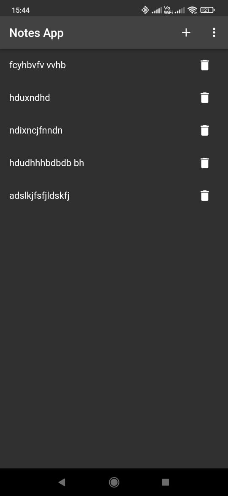
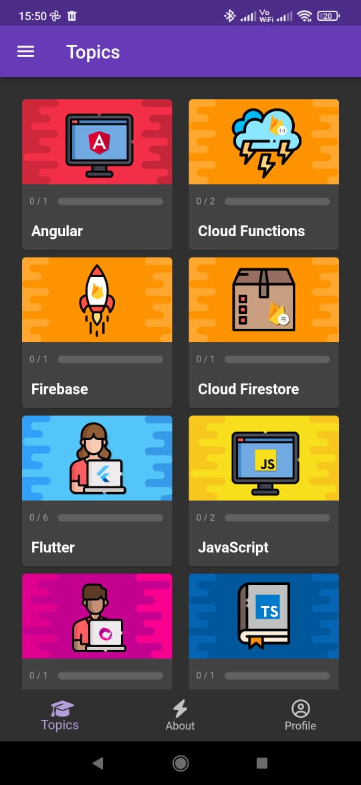
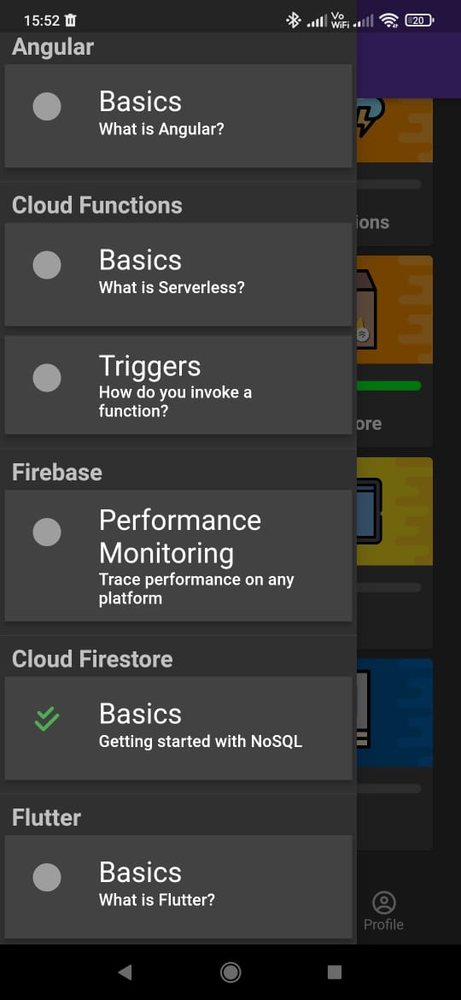
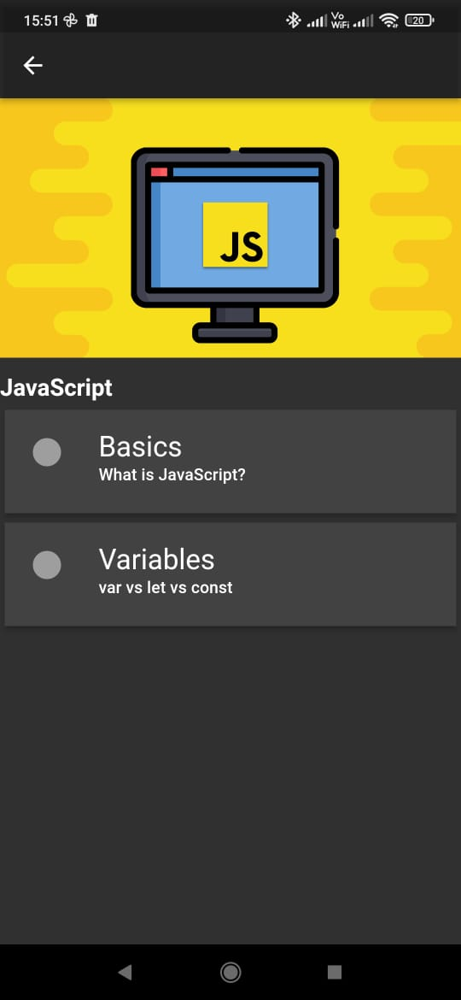
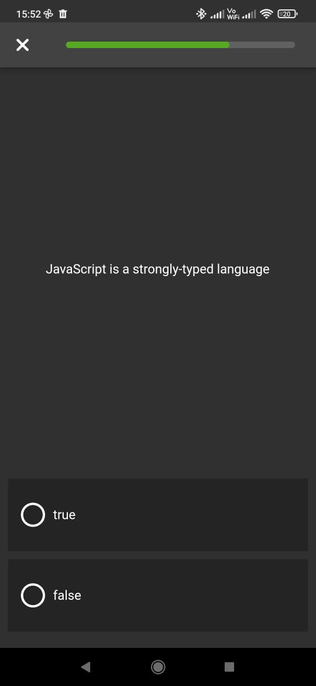

# Flutter

## Notes App

A full stack notes app made using Flutter & Firebase.
Users can create, share and delete notes.

[Hosted on Firebase hosting](https://oregairu-eightman.web.app/#/)

## Quiz app

A quiz app where users can takes quizes.
Made using Flutter and Firebase.

